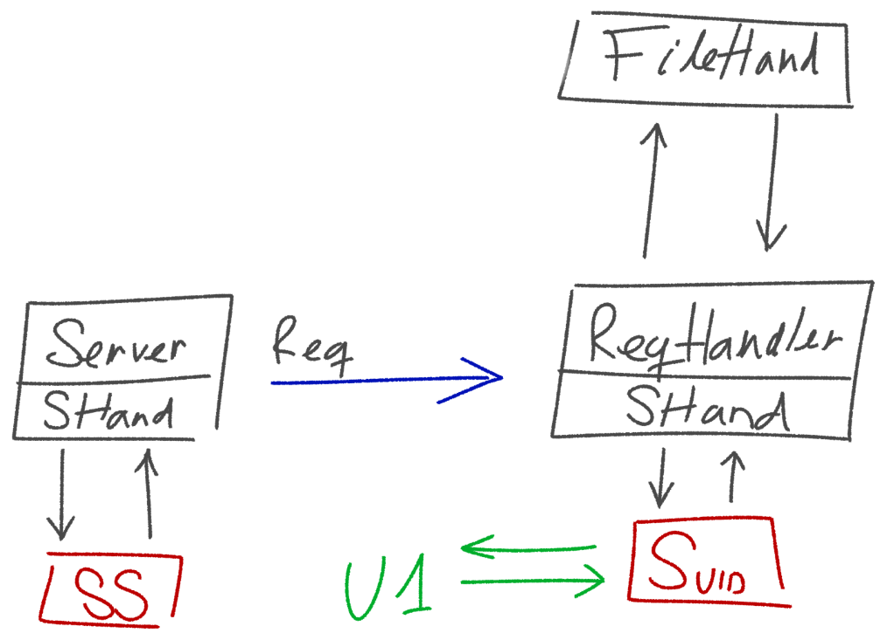

# **bropdox**
A DropBox clone as defined in the final assignment for SISOP 2.

It is a 2 part assignment and we'll use UNIX UDP sockets API in the
communication between the *Server* and the *Client* threads.

**Collaborators**:
- Henrique Silva
- Maria Clara Jacintho
- Luis Miguel do Santos Batista
- Vinícius Chagas

---

## **Building the project**

We are using the [inotify-cpp](https://github.com/erikzenker/inotify-cpp)
lib/wrapper to watch any file modification on the client's directory.

### **Make**
The Makefile has the following interface:
- **all**\
Builds the target `client` and `server` executables.
- **clean**\
Cleans the generated `.o`'s, binaries and temporary files.
- **redo**\
Does the `all` and then the `clean` rules.

---

## **Logic**
As of now, the project follows roughly this beautiful diagram I made myself:

Extra details can be found in the Moodle course page. I'll later populate this
README further.
